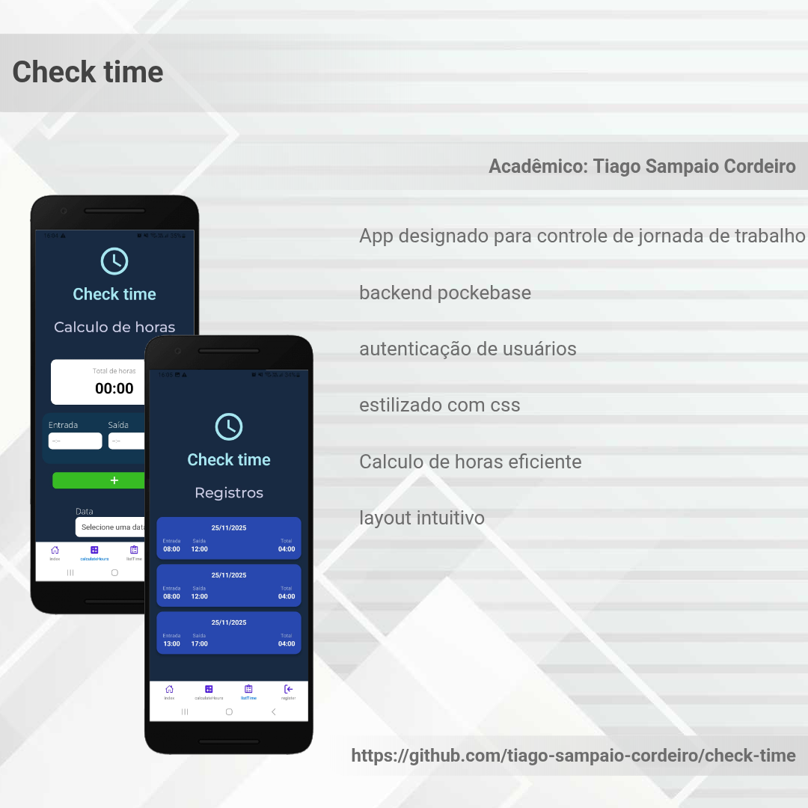

# Check time

## Sobre o app

O Check time é um aplicativo de acompanhamento de jornada de trabalho. O usuário pode calcular o tempo que foi trabalhado, podendo registrar entradas e saidas em diferentes periodos do dia.

## Funcionalidades principais

- Cálculo da jornada de trabalho
- O usuário pode adicionar ou remover quantas entradas e saidas quiser, nao sendo necessário inserir intervalo
- Tabela de registros com todos os dias adicionados

## Possíveis funcionalidades futuras

- Dois modos, um que o usuário pode registrar entradas e saidas e outro que pode calcular horas de maneira mais direta, inserindo valores brutos
- Calculo de horas por período, ou seja, uma soma total das horas de todos os dias adicionados
- Notificações para lembrar de bater o ponto

## Link para a pagina do figma

[Protótipo da aplicação](https://www.figma.com/design/7FV376NN5pPtOk4clyFEu2/Check-time?node-id=0-1&t=UvAwh6PTfdxbscoC-1)

## Banco de dados

[Modelo de banco de dados](https://dbdiagram.io/d/check-time-68bcdf6561a46d388ecaab75)

## Planejamento de Sprints

### Sprint 1 (Semana 1) – Configuração inicial

- [x] Criar projeto com Expo
- [x] Configurar expo router
- [x] Implementar tela de **Login** (mock simples, sem backend)
- [x] Implementar autenticação basica com pocketbase
- **Previsão:** 1 semana

---

### Sprint 2 (Semana 2) – Funcionalidades principais

- [x] Tela calcular horas trabalhadas”
- [x] Registro de entrada/saída
- [x] Persistência local com AsyncStorage
- [x] Diferenciar **entrada e saída**
- **Previsão:** 1 semana

---

### Sprint 3 (Semana 3) – Histórico e cálculos

- [x] Tela de **Histórico** com lista de registros
- [x] Cálculo de **horas trabalhadas por dia**
- [ ] Soma de horas em período selecionado
- **Previsão:** 1 semana

---

### Sprint 4 (Semana 4) – Refinamento e extras

- [ ] Editar/remover registros
- [x] Ajustes de layout e usabilidade
- [x] Testes e melhorias finais
- **Previsão:** 1 semana

### Atualizações desde o último checkpoint

- Utilizei zustand para estados globais(criei estados e ações para os inputs de user e password);
- Usei AsyncStorage para persistência nos campos user e password;
- Utilizei conceitos de boas praticas na criação dos componentes:

  - Atomic design na tela de login, onde atomizei o formulário de login até o nivel dos inputs
  - O titulo do app, o icone,botão de submit,cards com os horarios de netrada e saida e sub-titulo todos reutilizáveis, sendo o sub-titulo,botão de submit e cards com parâmetrização.

### Destaques da aplicação

### Justificativas

2 requisitos nao foram cumpridos, sendo:

- edição/remoçao de registros
- soma de horas em periodo selecionado

Infelizmente nao consegui implementar essas 2 funcionalidades por nao ter mais prazo.

### Recurso mais interessante e principais dificuldades:

- **Recursos mais interessante**

  - **Adição e remoção de pares**: usuário pode adicionar ou remover mais de um par de entrada e saida sem ter a necessidade de inserir um tempo de intervalo

  - **Pocketbase**: O Pocketbase traz uma facilidade na criação da aplicação, com ele nao é preciso se preocupar em configurar um backend do zero.

**Dificuldades no projeto**

- integrar o pocketbase apesar de ser facil de usar, sempre esbarrava em algum erro e perdia um tempo tentando descobrir o que estava errado;
